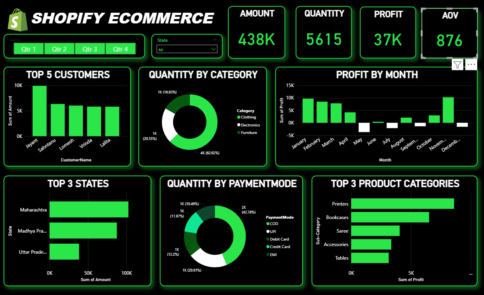

# Power BI Shopify E-Commerce Sales Dashboard

## 📊 Project Overview

An interactive **Power BI dashboard** designed to analyze Shopify e-commerce sales and understand sales performance, profitability, customer contribution, product categories, payment preferences, and regional trends.

The dashboard transforms e-commerce data into interactive visualizations and key performance indicators (KPIs) to provide a clear overview of business performance and sales activity.

---

## 🎯 Project Objectives

The main objectives of this project are to:

- Analyze overall e-commerce sales performance
- Evaluate total sales, quantity, profit, and average order value
- Identify top customers based on sales amount
- Analyze quantity distribution across product categories
- Track monthly profit performance
- Identify states with higher sales performance
- Analyze customer payment preferences
- Identify the most profitable product sub-categories
- Compare business performance across different quarters and states

---

## 🛠️ Tools & Technologies

- **Power BI**
- **Power Query**
- **DAX**
- **Data Cleaning**
- **Data Transformation**
- **Data Analysis**
- **Data Visualization**
- **Business Intelligence**

---

## 📌 Key Performance Indicators

The dashboard provides several important KPIs, including:

- **Total Sales Amount:** 438K
- **Total Quantity:** 5,615
- **Total Profit:** 37K
- **Average Order Value:** 876

---

## 📈 Dashboard Analysis

### 1. Top 5 Customers

Analyzes the sales contribution of the top five customers based on total sales amount.

The dashboard highlights:

- Jayant
- Sahantanu
- Lomesh
- Vinda
- Lalita

Among the displayed customers, **Jayant records the highest sales amount at approximately 10K**.

---

### 2. Quantity by Category

Analyzes the distribution of products sold across the major product categories:

- Clothing
- Electronics
- Furniture

The displayed analysis shows:

- **Clothing:** 62.62%
- **Electronics:** 20.55%
- **Furniture:** 16.83%

**Clothing** represents the largest share of total quantity among the displayed categories.

---

### 3. Profit by Month

Analyzes monthly profit performance throughout the year.

The dashboard compares profit across:

- January
- February
- March
- April
- May
- June
- July
- August
- September
- October
- November
- December

The analysis shows fluctuations in monthly profitability, with some months recording negative profit and **November showing the highest displayed profit**.

---

### 4. Top 3 States

Analyzes sales amount across the top-performing states.

The dashboard highlights:

- Maharashtra
- Madhya Pradesh
- Uttar Pradesh

Among the displayed states, **Maharashtra records the highest sales amount at approximately 100K**.

---

### 5. Quantity by Payment Mode

Analyzes the distribution of sales quantity across different payment methods:

- COD
- UPI
- Debit Card
- Credit Card
- EMI

The displayed distribution shows:

- **COD:** 43.74%
- **UPI:** 20.61%
- **Debit Card:** 13.20%
- **Credit Card:** 11.97%
- **EMI:** 10.49%

**COD** represents the largest share of quantity among the displayed payment methods.

---

### 6. Top 3 Product Categories

Analyzes the most profitable product sub-categories based on total profit.

The dashboard highlights:

- Printers
- Bookcases
- Saree
- Accessories
- Tables

Among the displayed sub-categories, **Printers** generate the highest profit.

---

## 🎛️ Interactive Filters

The dashboard includes interactive filters that allow users to explore the data dynamically.

### Quarter Filter

Users can analyze performance across:

- Qtr 1
- Qtr 2
- Qtr 3
- Qtr 4

### State Filter

Users can select a specific state or view the overall performance across all available states.

These filters allow users to analyze sales and profitability from different business perspectives.

---

## 🔍 Key Insights

Based on the dashboard analysis:

- **Clothing** accounts for the largest share of quantity among the displayed product categories.
- **COD** is the most frequently used payment mode in terms of quantity.
- **Maharashtra** is the highest-performing state among the displayed top three states.
- **Jayant** is the highest-performing customer among the displayed top five customers.
- **Printers** generate the highest profit among the displayed product sub-categories.
- Monthly profit varies throughout the year, with some months showing negative profitability.
- **November** records the highest displayed monthly profit.
- The dashboard provides an interactive way to compare business performance across quarters and states.

---

## 📷 Dashboard Preview

---

## 📂 Project Files

| File | Description |
|------|-------------|
| `shopify_dashboard.pbix` | Power BI dashboard file |
| `Orders.csv` | Order-related dataset used for analysis |
| `Products.csv` | Product and sales dataset used for analysis |
| `dashboard_preview.png` | Dashboard preview image |
| `README.md` | Project documentation |

---

## 🚀 How to Use

1. Download `shopify_dashboard.pbix` from this repository.
2. Open the file using **Microsoft Power BI Desktop**.
3. If required, reconnect the dataset or refresh the data.
4. Interact with the dashboard visuals and filters.
5. Explore sales, profitability, customer, product, payment, and regional insights.

---

## 💡 Skills Demonstrated

- Data Cleaning
- Data Transformation
- Data Analysis
- Data Visualization
- Dashboard Development
- KPI Development
- Interactive Reporting
- Business Intelligence
- Power BI
- Power Query
- DAX
- Data Storytelling
- Analytical Thinking

---

## 🎓 Project Purpose

This project was created as part of my **Data Analytics and Business Intelligence portfolio** to demonstrate practical skills in Power BI, data analysis, interactive dashboard development, data visualization, KPI development, and extracting meaningful business insights from e-commerce data.

---

## 👩‍💻 Author

**Simrat Kaur**

B.Tech Computer Science & Engineering  
Specialization: Artificial Intelligence & Machine Learning
